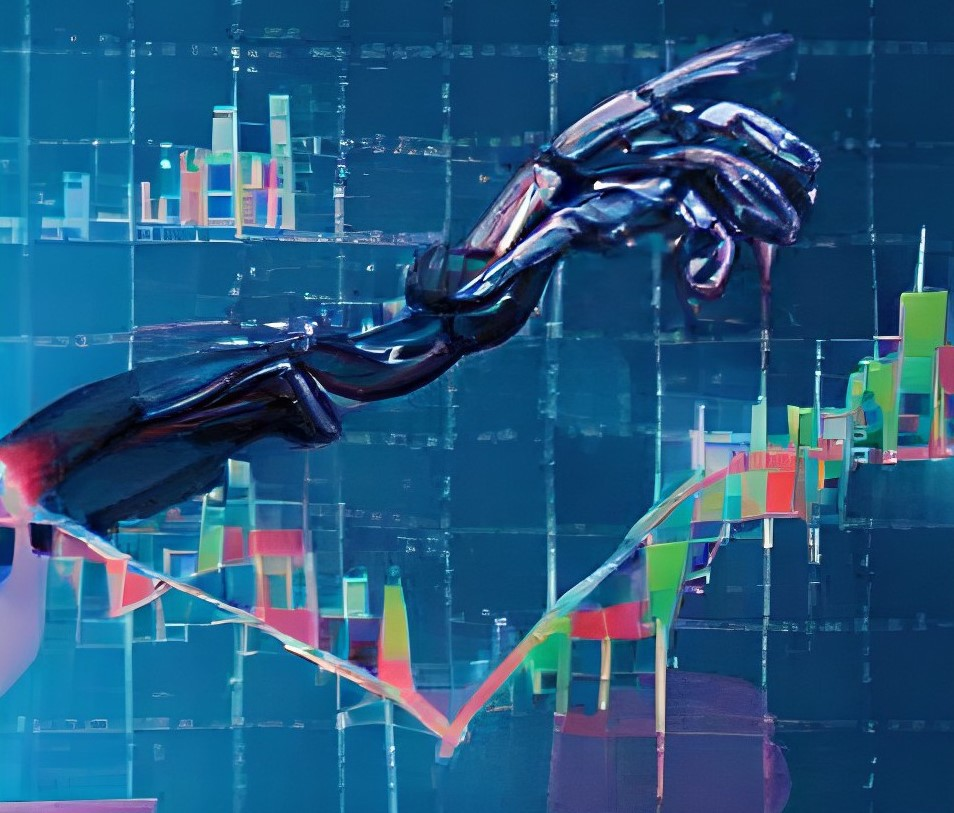

# BTC.ai
Final project for the Building AI course

## Summary
Predict the future by acknowledging the past. Find good investment momentums and make a profit with the pair BTC/USDT. Maximize your investments taking into consideration a large amount of indicators directly from the objective data, without letting your emotions interfere. Let a frozen heart analytic judgement ruled by artificial intelligence guide you with the things that matter most.


## Background

* Cryptocurrencies are rapidly gaining popularity among the population. Bitcoin is the genesis, pillar and base of all cryptos, therefore its study and value prediction has a greater interest with each passing day. Is there a fair value of bitcoin due to its finitude?

* Bitcoin has a great volatility, is there a way to make a profit of it?
* There are dozens of indicators to try and predict BTC price. However, the lack of a company behind and goverment regulations, and a general spread rejection makes it harder to analyze. Can we take risks and gain in most ocassions?
* Factors such as wars or worldwide catastrophes also affect bitcoin's price, however it seems to work in some unexpected and unpredictable ways sometimes. A correlation with NASDAQ and DAX can be perceived. Can we estimate the price anyway?
* In the past different approaches to fair price estimation have been studied, such as the Black-Scholes classical and time-fracional models for pricing european options. This time instead of numerical methods and subdiffusive fractional differential equations, a machine learning approach will be taken in orden to predict a completely different active.


## How is it used?
BTC.ai is multi-purpose and can be used at any time when you want to try and foreseek the the future price of the cryptocurrency. It can be either used for short-time predictions or long-run ones. On the other hand, it can be used as a potential indicator or directly as a auto-investment artificial intelligence. If used automatically the system won't collect your API's personal key. Used as a external advisor no personal data or identification is required, therefore no data of the user would be stored at all. 


The AI will gather data through Binance and constantly readjust itself to provide the most realiable predictions at all times. Without a Binance account it is no possible to use as your AI inverstor, just as your AI advisor. 




Daily or hourly candlesticks will be the data studied, and predictions will be shown also as candlesticks in a graph. However, the advisor can also provide the user with adaptable predictions of the most suitable moments for buying and selling the underlaying active. 

Tensorflow library will be used to try and develop the proper algorithm in order to achieve the desired result or a first approach to it. A code structure should be as it follows:

```
def machine_learning(data):
   #Filtering the required data out of the input data (it should be a dictionary)
   #Dividing the data into learning and testing data
   #Tensorflow code with a 4 layer neural network with a long study to predict 
   #NLP for relevant news related to BTC (acceptance, rejection, indexes, banks' actives)
   

def main(days,advisor,investor):
   global candlesticks
   predCandelesticks=[]
   advice=[]
   
   for i in range(len(days)):
      predCandlesticks.append(predictor(i))
   
      if advisor != ~ or advisor != "no":
         advice.append(advisor(i))
      
   if investor != ~ or advisor != "no":
      #Some nasty code including entering API's public key and personal key and accepting and accepting a contract.


# An interface may be created in order to provide the user an easy tool to "play" with. (Investing in cryptocurrencies carries high risks and may result in the loss of all money invested) 
```


## Data sources and AI methods
The data is collected through Binance Client. AI methods based on Tensorflow neural networks for regression predisctions.

## Challenges
* A first contact with Tensorflow has been taken. 
* Large datasets and dataframes mapnipulations have been tackled.
* Candlesticks charts representation achieved through plotly.
* Various minor challenges developing all the code.
* Further research requiered in order to create a better model, therefore there's only a preliminary algorithm. 

## What next?

NLP implementation, correlation analysis with the most relevant indexes, long time predictions, better data manipulation and features for greater predictions. Determine different features for Close, High, Low predictions. Further research and development could lead to the design of the personal investor, if and only if the algorithm predictions begin to be accurate and show they could be profitable somehow. Finally an online app should be created, private or public to provide the people with some minor tools to cryptocurrencies investments, in addition to all existing ones.


## Acknowledgments
Algovibes - Youtube. TensorFlow. Binance. BuildingAI Course.
